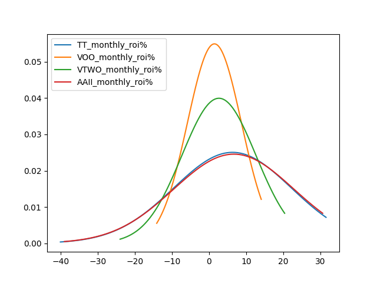

# Motivation

I started this project after reading several finance books that advocate for 
value investing. These include Investing at Level III by James Cloonan and 
then What Works on Wallstreet and Predicting the Markets of Tomorrow by James 
O'Shaughnessy. 

In O'Shaughnessy's book the strategy with the largest long term returns was a
micro-cap strategy called Tiny Titans (TT). I wanted to see if I could recreate 
these results myself and compare the robustness of TT to other benchmarks,
especially to see how it compares when you factor taxes in. 

# The Tiny Titans Strategy

TT is a simple 5-step strategy:

1. Consider only stocks with a market cap between 25 and 250 million
2. Eliminate the stocks with a price-to-sales ratio greater than 1
3. Rank the stocks by 1-year price appreciation
4. Invest in the top 25 stocks on the list equally
5. Repeat the process annually (or monthly)

Now the annual cycle was chosen mostly because of a limitation of the software
O'Shaughnessy was using. The American Association of Individual Investors 
website has a benchmark using a monthly cycle instead (which does even better).
So I opted to replicate that https://www.aaii.com/stocks/screens/59 .

# Data Cleaning

The most difficult aspect of this project was dealing with missing or 
incomplete data. Polygon was used as the main data source https://polygon.io/ .

The market cap for each ticker had to be adjusted for the case where multiple
ticker's share the same cik, i.e. are different portions of the same company.

Furthermore, logic for corporate actions had to be added using 
https://stockanalysis.com/ . This way we could properly adjust for changes in
ticker symbols and bankruptcies. 

The most common issue we encountered was simply recieving nans for various 
datapoints. This is either because (a) the data simply didn't exist, for 
example a particular microcap may have had no trades on one day or because (b)
the data was just missing from polygon.

In the case of missing closing price data our solution was just to check prior
days within a specified period to see if the stock was traded and use one of 
the last available close. If there were no datapoints in that period we 
implemented a scheme so you could set a fill in "depreciation" to approximate.

For other data such as market cap or revenue data, if the needed datapoint 
could not be obtained the stock was generally eliminated from the investment
list or "depreciated" as above if we were currently holding. There was an 
exception with certain revenue data where we could use data from the previous
year to approximate the trailling twelve month revenue at the current quarter.

# Warning

While I was testing variations of the TT strategy I got curious and decided to 
examine the returns if I reversed the momentum sorting, i.e. you invested in
the companies that lost the most money over the previous year. To my surprise,
returns were significantly better and seemed too good to be true.

Upon closer examination, the returns were the result of singular stocks 
multiplying in price over short time periods. There were an isolated number of 
these incidents over the 8 year experimental period. I started doing research 
into these stocks and discovered that this was not actually true price 
appreciation but reverse stock splits that polygon had not properly adjusted 
for. Based on my experience, the polygon data is generally adjusted for normal
stock splits, but it seems for little known micro-cap stocks there are a 
significant number that had not been adjusted at the time of this experiment.

# Experiment Setup

Several experiments were executed computing appreciation using the last trading
day of every month. The growth of funds for our custom TT implementation as 
well as AAII's and the S&P500 and Russell 2000 benchmarks were computed from
2013-06-28 until 2022-04-29. This spans 107 months or almost a 9 year period.

Different results run using different missing approximations primarily. 
Decreasing the number of stocks increased volatility without increasing 
appreciation reliably. Playing with parameters such as the price-to-sales ratio
and market cap min and max did not improve performance significantly. 

# Results

Below is a replication of Tiny Titans where if a nan is encountered for monthly
appreciation we use the last available price over two weeks to approximate. If 
we cannot find this price 0 is used. As you can see even with this generous 
generous approximation results are significantly below AAII's implementation.

Although, it is important to note we see the same characteristic behavior and
shape, such as the significant draw down at month 80. Likewise we are able to
outperform the S&P 500 and Russell 2000 benchmarks with respect to the end long
term appreciation. However, one should also note that we only outperform the 
S&P 500 slightly at the end and underperform for significant periods of time.

For this experiment 58 nans (missing price appreciation for a particular stock)
were encountered in total so about one out of every two months had a price we 
couldn't compute the exact appreciation of.

So it is unclear if the performance of TT would continue to be superior to the 
S&P if we were able to extend the test for a few decades.

Note that VOO and VTWO are vanguard operated ETFs which approximate the S&P 500
and the Russell 2000 repectively. 

When we just mark all the nans as zero results drop significantly and you're 
better off just holding your money.

If we take the mean and standard deviation of the returns for each month for
for all strategies and plot the fitted normal distributions we get the plot 
below. 

Note that the AAII and our custom TT distributions match up pretty closely with
this normal fitting. Both distributions are wider than VOO and VTWO's but have 
a larger mean. 

# Differences with AAII Portfolio

It seems we were able to replicate AAII's TT reasonably well but not perfectly.
Differences are the result of the following (listed in order of importance):

    (a) Missing data. In certain circumstances the ticker data is just not
        present in the polygon data but is present in AAII's datasource 
        (Refinitiv)

    (b) As I only included stocks from the NYSE and NASDAQ I missed a handful 
        of OTC assets which were included in AAII's portfolio. Note that in 
        AAII's TT, a stock must be listed on the NYSE or NASDAQ to be invested
        in. However, they include assets which were listed within the last year
        whereas I do not for the sake of my momentum calculations.

    (c) In certain cirumstances AAII rounds their data which has an effect on 
        their portfolio calculations. For example, they would round a 
        price / sales ratio of 1.001 to 1 and include it in their calculations
        whereas I would have eliminated it as it's greater than one.

Given that the portfolio is only 25 stocks these differences make a significant
difference in returns. 

# Conclusion

Upon completion of this experiment I decided that I'd rather invest in the S&P
500 than TT. This is because:
    (a) The strategy itself is quite volatile
    (b) It's very sensitive to small differences in the data
    (c) When you include taxes from rebalancing, the returns drop dramatically
        when compared with an S&P 500 ETF which would be much more tax 
        efficient and experiences much less volatility.

Also, this experiment made me skeptical of using polygon for long term 
calculations. I became interested in the concept of developing a news based 
day trading algorithm, so I investigated this next.

